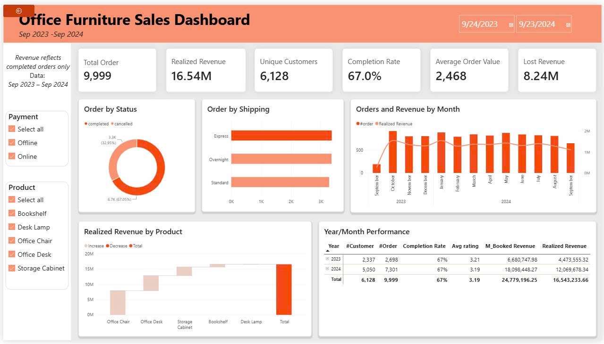
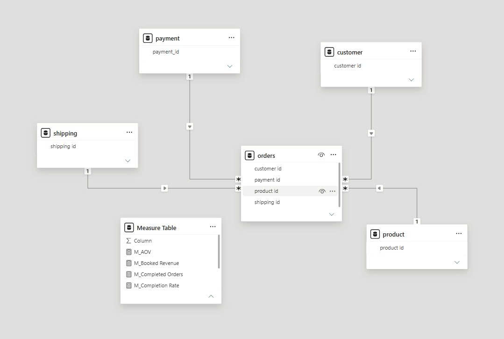

# Office Furniture Sales Dashboard
### 辦公家具銷售儀表板

**Power BI · DAX · Power Query**

[**→ 開啟互動式儀表板 / View interactive dashboard**](ADD_YOUR_LINK_HERE)



---

## 中文版

### 專案簡介

分析某辦公家具零售商 2023 年 9 月至 2024 年 9 月共 9,999 筆訂單。公司原本只追蹤訂單總額，無法掌握其中有多少真正轉換為營收，也不清楚哪些品項實際帶動銷售。本專案聚焦兩個問題：取消訂單造成多少營收損失，以及產品線的銷售是否過度集中。

### 資料來源

五個 CSV 檔案，採星型架構：`orders` 為事實資料表（9,999 筆），`customer`（12,136 筆）、`product`（13 筆）、`payment`、`shipping` 為維度資料表。



### 資料整理

原始資料需要大幅清理才能支撐可靠的計算。

**欄位值不一致** — `order status` 只有兩種狀態，實際卻出現九種寫法，包含大小寫差異與拼字錯誤（`Copleted`）。在 Power Query 以對照表處理，而非字串比對，讓未預期的值直接顯示為錯誤而不被忽略。

**欄位未拆分** — 數量與處理成本被存成單一字串（`'7': '126.82'`），拆成兩個獨立欄位並轉換型別。

**日期格式受地區設定影響** — 日期以美式文字格式（M/D/YYYY）儲存。改用指定地區的轉換方式，避免在非美國區域設定下每月前十二天被誤判。

**營收定義不明確** — 原始資料沒有營收欄位。定義兩個量值而非一個，因為兩者的差額正是本專案的核心發現：

```dax
Booked Revenue = SUMX(orders, orders[quantity] * RELATED(product[unit price]))
Realized Revenue = CALCULATE([Booked Revenue], orders[status] = "Completed")
Lost Revenue = [Booked Revenue] - [Realized Revenue]
```

同樣的陷阱也出現在客單價：分子與分母必須採用相同母體。以訂單總額除以已完成訂單數，會讓客單價虛增約 50%。

### 主要發現

**一、三分之一的訂單金額未轉換為營收**

訂單總額 24.78M，實際營收僅 16.54M，**8.24M（33%）因取消訂單而流失**。若將訂單總額報告為營收，將高估績效約 50%。儀表板因此同時呈現兩個數字，而非單一「營收」欄位。

**二、取消率平均分布，並未集中於特定族群**

完成率在每個月都維持 67%，以產品類別、付款方式或運送方式篩選後亦無明顯變化，平均評分同樣穩定在 3.19。

這個結果本身即具行動意義：現有欄位無法解釋取消原因。若要進一步診斷，需補充取消原因代碼、下單當下的庫存狀況、實際與承諾到貨日的落差，以及取消是由客戶或公司發起。在此情況下建議補充資料收集，比從毫無變異的欄位硬套結論更為妥當。

**三、產品線銷售過度集中**

13 個品項中僅 5 項有實質銷售，其餘 8 項幾乎沒有貢獻。這些品項可能是上架設定錯誤、長期缺貨，或確實無市場需求，但現有資料無法區分，建議進行產品線檢視。

### 建議事項

1. **訂單總額與實際營收分開呈現** — 合併為單一數字會隱藏 8.24M 的落差。
2. **建立取消流程的資料收集機制** — 補上原因代碼與庫存欄位後，才有進行根因分析的基礎。
3. **檢視 8 項無銷售品項** — 釐清是上架問題或需求問題。

### 限制說明

資料期間僅 13 個月，不足以評估季節性或單一購買週期以外的回購行為。原始資料未標示幣別。年齡與性別欄位在各項指標上皆無顯著差異，因此保留為篩選器，未作為分群依據。

---

## English

### Overview

Analysis of 9,999 orders from an office furniture retailer (Sep 2023 – Sep 2024). The company tracked total order value but could not see how much of it became actual revenue, or which products were driving sales. Two questions drove this project: how much revenue is lost to cancelled orders, and whether sales are too concentrated in a few products.

### Data

Five CSV files in a star schema: `orders` as the fact table (9,999 rows), with `customer` (12,136), `product` (13), `payment`, and `shipping` as dimensions.

### Data preparation

The raw data needed significant cleaning before it could support reliable measures.

**Inconsistent values** — The `order status` column had nine different spellings for two intended values, including case differences and a typo (`Copleted`). Handled in Power Query with a mapping table rather than a string match, so unexpected values appear as errors instead of being ignored.

**Column not split** — Quantity and handling cost were stored as one string (`'7': '126.82'`). Split into two typed columns.

**Locale-dependent dates** — Dates were stored as text in US format (M/D/YYYY). Converted using an explicit locale to avoid misreading the first twelve days of each month under non-US regional settings.

**Unclear revenue definition** — The source had no revenue column. I defined two measures instead of one, because the gap between them is the main finding:

```dax
Booked Revenue = SUMX(orders, orders[quantity] * RELATED(product[unit price]))
Realized Revenue = CALCULATE([Booked Revenue], orders[status] = "Completed")
Lost Revenue = [Booked Revenue] - [Realized Revenue]
```

The same trap applies to average order value: the numerator and denominator must use the same population. Dividing booked revenue by completed orders inflates AOV by about 50%.

### Findings

**1. One third of booked value never becomes revenue**

Of 24.78M in booked order value, only 16.54M was realised. **8.24M (33%) was lost to cancellations.** Reporting booked value as revenue overstates performance by around 50%, so the dashboard shows both figures instead of a single "revenue" number.

**2. The cancellation rate is even, not concentrated**

Completion rate stays at 67% in every month, and does not change much when filtered by product type, payment method, or shipping method. Average feedback is also flat at 3.19.

This is the useful result in itself: no field in the current data explains why orders are cancelled. To diagnose the problem, the business would need cancellation reason codes, stock levels at the time of order, actual versus promised delivery dates, and whether the customer or the company cancelled. Recommending better data collection is more honest than forcing a conclusion from fields that show no variation.

**3. Sales are concentrated in a few products**

Only 5 of 13 products have real sales. The other 8 contribute almost nothing. They may be listing errors, long-term stockouts, or products with no demand — the current data cannot tell the difference, so a catalogue review is recommended.

### Recommendations

1. **Report booked and realised revenue separately.** A single figure hides the 8.24M gap.
2. **Add data collection to the cancellation process.** Reason codes and stock fields are needed before any root-cause analysis.
3. **Review the 8 products with no sales.** Decide whether this is a listing problem or a demand problem.

### Limitations

The data covers only 13 months, which is not enough to assess seasonality or repeat purchase behaviour. Currency is not stated in the source. Age and gender show no meaningful difference across any measure, so they were kept as filters rather than used for segmentation.

---

## Repository

```
├── data/         原始 CSV 檔 / Raw CSV files
├── pbix/         Power BI 檔案 / Power BI file
├── images/       截圖 / Screenshots
└── README.md
```

**Tools:** Power BI Desktop · DAX · Power Query (M)
